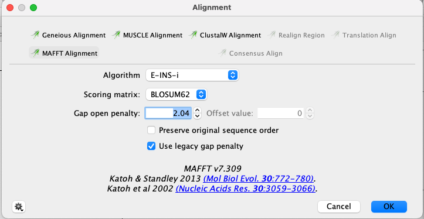

# Ant-Associated Viral Metagenomics Workflow
## Dependencies 
[Java](https://www.java.com/en/) <br>
[Perl](https://www.perl.org/) <br>
[FastQC](https://www.bioinformatics.babraham.ac.uk/projects/fastqc/) <br>
[Bowtie2](http://bowtie-bio.sourceforge.net/bowtie2/index.shtml) <br>
[Samtools](http://samtools.sourceforge.net/) <br>
[Trimmomatic-0.35](http://www.usadellab.org/cms/?page=trimmomatic) <br>
[Spades 3.14.0](https://github.com/ablab/spades/releases) <br>
[BBMap](https://sourceforge.net/projects/bbmap/) <br>
[Diamond](https://github.com/bbuchfink/diamond) <br>
[Blast 2.6.0](https://ftp.ncbi.nlm.nih.gov/blast/executables/blast+/LATEST/) <br>
[CheckV](https://bitbucket.org/berkeleylab/checkv/src/master/) <br>
[CD-Hit v4.8.1](http://weizhong-lab.ucsd.edu/cd-hit/) <br>
[VirSorter2](https://github.com/jiarong/VirSorter2) Note: used [CyVerse](https://de.cyverse.org/) version of VirSorter2 <br>

Phylogenetics Pipeline <br>
[ProtTest v3.4.2](https://github.com/ddarriba/prottest3) <br>
[EMBOSS 6.6.0](http://emboss.sourceforge.net/download/) <br>
[MAFFT v.7.309](https://mafft.cbrc.jp/alignment/software/) <br>
[TrimAl v1.2](http://trimal.cgenomics.org/downloads) <br>
[Geneious 10.2.3](https://www.geneious.com/) <br>
[RAxML v8.2.11](https://cme.h-its.org/exelixis/web/software/raxml/) <br>
[R v4.0.3](https://www.r-project.org/) <br>
[BaTS](https://mybiosoftware.com/tag/bats) <br>

## Bioinformatics Pipeline
This workflow starts with raw paired-end HiSeq data in FASTQ.gz format assumed to be located within a folder called raw_data. For steps 1-8 of this pipeline I will be illustrating with sequences from a single sample (*Atta cephalotes*), a leafcutter ant species. I used this as the example since this sample had the fewest number of viral contigs found within our dataset, so the file sizes are a bit smaller.
For steps 9-30 of this pipeline, the contigs from every sample in the dataset are collated. 
1. Run fastqc for manual inspection of the quality of the sequences.
```sh
mkdir fastqc_out
fastqc -t 4 /raw_data/* -o /fastqc_out/
```

2. Concatenate the forward and the reverse reads from multiple lanes of sequencing together. 
```sh
cat /raw_data/32A_GTGAATAT-GAATGAGA-AHNFFJBBXX_L004_R1.fastq.gz /raw_data/32A_GTGAATAT-GAATGAGA-AHNFFJBBXX_L005_R1.fastq.gz /raw_data/32A_GTGAATAT-GAATGAGA-AHWYVLBBXX_L005_R1.fastq.gz > /raw_data/concat_data/Aceph_concatenated_R1.fastq.gz

cat /raw_data/32A_GTGAATAT-GAATGAGA-AHNFFJBBXX_L004_R2.fastq.gz /raw_data/32A_GTGAATAT-GAATGAGA-AHNFFJBBXX_L005_R2.fastq.gz /raw_data/32A_GTGAATAT-GAATGAGA-AHWYVLBBXX_L005_R1.fastq.gz > /raw_data/concat_data/Aceph_concatenated_R2.fastq.gz
```

3. Trim the contactenated reads to remove adapters and low quality reads using Trimmomatic.
```sh
java -jar Trimmomatic-0.35/trimmomatic-0.35.jar PE -phred33 \
/raw_data/concat_data/Aceph_concatenated_R1.fastq.gz /raw_data/concat_data/Aceph_concatenated_R2.fastq.gz  \
/raw_data/concat_data/Aceph_pe1.fq /raw_data/concat_data/Aceph_unp1.fq /raw_data/concat_data/Aceph_pe2.fq /raw_data/concat_data/Aceph_unp2.fq \
ILLUMINACLIP:Trimmomatic-0.35/adapters/TruSeq3-PE-2.fa:2:30:10 LEADING:3 TRAILING:3 SLIDINGWINDOW:4:15 MINLEN:36
```

 4. Build ant species specific genome database in bowtie2. For this particular sample I used the *Atta cephalotes* genome downloaded from NCBI.
```sh
bowtie2-build /data/Aceph/A_cephalotes_genome.fasta /data/Aceph/Aceph

```
5.  Map ant genome to paired reads using Bowtie2, unmapped reads are carried through to the assembly.
```sh
bowtie2 -t -x /data/Aceph/Aceph -1 /raw_data/concat_data/Aceph_pe1.fq  -2 /raw_data/concat_data/Aceph_pe2.fq --un-conc /raw_data/concat_data/Aceph_conc_unmapped.fastq --al-conc /raw_data/concat_data/Aceph_conc_mapped.sam

```
6. Use SPAdes assembly program to cross-assemble all unmapped reads from step 5. The single cell option (--sc) worked best for this data, but the --meta option may work better depending on your dataset. 
```sh
SPAdes-3.14.0-Linux/spades.py --sc --pe1-1 /raw_data/concat_data/Aceph_conc_unmapped.1.fastq --pe1-2 /raw_data/concat_data/Aceph_conc_unmapped.2.fastq -k 21,33,55,77,99,127  -o /data/spades_output
```

7. Using removesmalls.pl, only retain contigs 300 bp or larger.
```sh
perl /data/removesmalls.pl 300 /data/spades_output/scaffolds.fasta > /data/Aceph/Aceph_scaffolds_300.fasta
```

8. Using Bowtie2, map these contigs back to reads for that sample to assess read coverage of each individual contig.
```sh
bowtie2-build /data/Aceph/Aceph_scaffolds_300.fasta /data/Aceph/Aceph_scaffolds_300.fasta

bowtie2 -p 12 -x /data/Aceph/Aceph_scaffolds_300.fasta -1 /raw_data/concat_data/Aceph_pe1.fq  -2 /raw_data/concat_data/Aceph_pe2.fq -S /data/Aceph/Aceph_reads.map.sam

samtools faidx /data/Aceph/32_scaffolds_300.fasta

samtools view -bt /data/Aceph/Aceph_scaffolds_300.fasta.fai /data/Aceph/Aceph_reads.map.sam > /data/Aceph/Aceph_reads.map.bam
samtools sort /data/Aceph/Aceph_reads.map.bam  -o /data/Aceph/Aceph_reads.map.sorted.bam
samtools index /data/Aceph/Aceph_reads.map.sorted.bam


bbmap/pileup.sh in=/data/Aceph/Aceph_reads.map.sorted.bam out=/data/Aceph/stats_Aceph_cov.txt hist=/data/Aceph/histogram_Aceph_cov.txt

```
Steps 1-8 were subsequently performed on all 44 samples and 1 control sample to assemble into contigs. I do not include all sample data here for step 1-8 since it is several TBs.  Steps 9-30 include data for all samples including the *Atta cephalotes* sample processed in steps 1-8. Additionally, all data for steps 9-29 can be found within the "data" file. 

9. Run cd-hit on samples from each seperate contig file in the dataset. Cd-hit filters the contigs for redundancy, in this case at 95% sequence similarity.
```sh
work_dir="data/all_sample_scaffolds/"
read_dir="/data/cdhit_output/"

cd "${work_dir}"

for i in *.fasta
do

/cd-hit-v4.8.1-2019-0228/cd-hit -i "${i}" -o "${read_dir}/${i//}_cdhit.fasta" -aS 0.95 -c 0.95 -n 5 -d 0

done

```

10. Concatenate all contigs from this dataset together into fasta file.
```sh
cat /data/cdhit_output/*.fasta > /data/contigs/combined_contigs.fasta
```
11. Sort contigs by length in descending order using BBMap
```sh
/bbmap/sortbyname.sh in=/data/contigs/combined_contigs.fasta out=/data/contigs/combined_contigs_sorted.fasta length descending
```

12. Create single line fasta file from all coombined contigs.
```sh
perl -pe '$. > 1 and /^>/ ? print "\n" : chomp' /data/contigs/combined_contigs_sorted.fasta > /data/contigs/combined_contigs_sorted_single.fasta
```

13. Use VirSorter2 version 2.1.0 to identify further viral contigs from your cross-assembled contigs. I found that the CyVerse version of VirSorter2 worked better than the command line versions. I used VirSorter2 pre-set parameters for this analysis. Output file from VirSorter2 is: **virsorter_contigs.fa** in the /data/contigs folder.

14. Download Non-redundant protein database (nr) from NCBI with taxonomic information. This is 192GB so I just include information about how to do this here, but not actually the large files.
```sh
mkdir -p /nr; cd nr
wget -O - ftp://ftp.ncbi.nlm.nih.gov/blast/db/FASTA/nr.gz \
 | pigz -d - \
 > nr.fa

wget ftp://ftp.ncbi.nlm.nih.gov/pub/taxonomy/accession2taxid/prot.accession2taxid.gz
wget ftp://ftp.ncbi.nlm.nih.gov/pub/taxonomy/taxdmp.zip
unzip taxdmp.zip
```
15. Create DIAMOND formatted non-redundant protein database (.dmnd). 
```sh
diamond makedb -p 14 --in nr.fa \
  --taxonmap prot.accession2taxid.gz \
  --taxonnodes nodes.dmp \
  --taxonnames names.dmp \
  -d nr
```

**Decontamination of Samples with Control Sample** <br>
16. Create a database with taxonomy for decontamination of samples, the taxonomy files are quite large so I have not included them in this workflow, but you can download them to your server from NCBI. 

```sh
/diamond/diamond makedb --in /decontamination/control_sample_contigs.fasta --db /decontamination/decontamination_db --taxonmap /nr/prot.accession2taxid.gz --taxonnodes /nr/nodes.dmp --taxonnames  /nr/names.dmp --threads 20 &
```
17. Create a database of "contaminant" samples using the contigs from the control sample.
```sh
/diamond/diamond makedb --in /data/decontamination/control_sample_contigs.fasta -d /data/decontamination/decontamination_db
makeblastdb -in /data/decontamination/control_sample_contigs.fasta -out /data/decontamination/Decon -dbtype nucl -input_type fasta
```

18. Using BLAST, search all discovered contigs against the control sample. I used BLAST instead of DIAMOND here since it is a nucleotide-nucleotide search and DIAMOND is only functional for protein and translated protein searches. DIAMOND is generally preferable since it is much faster.

```sh
blastn -num_threads "40" -db /data/decontamination/Decon -outfmt "6" -max_target_seqs "1" -evalue "1e-5" -max_hsps 1  -out /data/decontamination/contaminated_contigs.out -query /data/contigs/combined_contigs_sorted.fasta &
```
19. Delete contaminated sequences from assembled contigs.
```sh
awk 'BEGIN{while((getline<"contam.txt")>0)l[">"$1]=1}/^>/{f=!l[$1]}f' /data/contigs/combined_contigs_sorted_single.fasta > /data/contigs/combined_contigs_decontam_single.fasta
```
20. Search contigs on viral RefSeq database with blastx (RefSeq is a more heavily curated database than nr). RefSeq Viral Protein database can be downloaded here: [RefSeq Viral Protein Database from NCBI](https://www.ncbi.nlm.nih.gov/protein?term=%28%22Viruses%22%5BOrganism%5D%20AND%20srcdb_refseq%5BPROP%5D%20AND%20viruses%5Bfilter%5D&cmd=DetailsSearch) and converted into a .dmnd file. This tutorial is helpful: https://andreirozanski.com/2020/01/03/building-a-diamond-db-using-refseq-protein/

```sh
/diamond/diamond blastx -p "40" -d /data/RefSeq_protein_viral_database.dmnd -f "6" qseqid sseqid pident length mismatch gapopen qstart qend sstart send evalue bitscore staxids sscinames sskingdoms skingdoms sphylums stitle qtitle qstrand -k "1" --evalue "1e-3" --max-hsps 1 --sensitive -o /data/contigs/RefSeq_blastx_contigs.out -q /data/contigs/combined_contigs_decontam_single.fasta &
```
21. Extract viral fasta sequences from  blastx refseq results (to make txt file need to do this in text wrangler)
```sh
awk -F'>' 'NR==FNR{ids[$0]; next} NF>1{f=($2 in ids)} f' /data/contigs/RefSeq_viral_contigs.txt /data/contigs/combined_contigs_decontam_single.fasta > /data/contigs/viral_contigs_refseq.fasta
```
22. Delete anything after | in fasta header to make VirSorter2 output file compatible with RefSeq viral contig output file.
```sh
cut -d'|' -f1 /data/contigs/virsorter_contigs.fa > /data/contigs/virsorter_contigs1.fa
```
23. Find viral contigs which were in common between RefSeq and VirSorter2 searches. 
```sh
awk '/^>/{if (a[$1]>=1){print $1}a[$1]++}' /data/contigs/virsorter_contigs1.fa /data/contigs/viral_contigs_refseq.fasta > /data/contigs/common_viral.txt
```
24. Using perl, Take away > from each line in text files for VirSorter and RefSeq viral contig comparison.
```sh
perl -pe 's,.*>,,' /data/contigs/common_viral.txt > /data/contigs/common_viral1.txt
```

25. Delete same sequences from virsorter contig file
```sh
awk 'BEGIN{while((getline<"common_viral2.txt")>0)l[">"$1]=1}/^>/{f=!l[$1]}f' /data/contigs/virsorter_contigs_1.fa > /data/contigs/virsorter_unique_viruses.fa
```
26. Combine viral RefSeq contigs and Virsorter2 contigs into one file.
```sh
cat /data/contigs/virsorter_unique_viruses.fa /data/contigs/viral_contigs_refseq.fasta > /data/contigs/Refseq_virsorter_contigs.fasta
```
27. Using DIAMOND, Search nr database Blastx (search protein databases using a translated nucleotide on combined viral contigs (from RefSeq and VirSorter2) to further confirm these putatitive viral sequences.
```sh
/diamond/diamond blastx -p "50" -d /nr/nr_diamond.dmnd -f "6" qseqid sseqid pident length mismatch gapopen qstart qend sstart send evalue bitscore staxids sscinames sskingdoms skingdoms sphylums stitle qtitle qstrand -k "1" --evalue "1e-3" --max-hsps 1 --sensitive -o /data/contigs/NR_blastx_contigs.out -q /data/contigs/Refseq_virsorter_contigs.fasta &
```
28. Extract viral nucleotide contig sequences from blastx search results (to make txt file need to do this in text wrangler).
```sh
awk -F'>' 'NR==FNR{ids[$0]; next} NF>1{f=($2 in ids)} f' /data/contigs/viruses_NR.txt /data/contigs/Refseq_virsorter_contigs.fasta > /data/contigs/final_NR_viral_contigs.fasta
```
29. Use CHECKV program to search for proviral contamination within these putatitive viral contigs. 
```sh
export CHECKVDB=/checkv-db-v1.0
checkv contamination /data/contigs/final_NR_viral_contigs.fasta  /contigs/checkv_output
```
30. Extract viral nucleotide contig sequences from  blastx NR results with proviruses and retroviruses and endogenous viruses removed (to make txt file need to do this in text wrangler) and only 500bp
```sh
awk -F'>' 'NR==FNR{ids[$0]; next} NF>1{f=($2 in ids)} f' /data/contigs/final_viruses.txt /data/contigs/final_NR_viral_contigs.fasta > /data/contigs/final_viruses.fasta
```

## Phylogenetics Pipeline
This portion of the workflow takes only the viral contigs which had most similarity to the viral phylum [Cressdnaviricota](https://talk.ictvonline.org/taxonomy/p/taxonomy-history?taxnode_id=202107372) (CRESS viruses) to illustrate the phylogenetic workflow for each viral clade analyzed. 

1. Extract CRESS viruses from all viral contigs.
```sh
awk -F'>' 'NR==FNR{ids[$0]; next} NF>1{f=($2 in ids)} f' /Phylogenetics_data/CRESS_viruses.txt /Phylogenetics_data/final_viruses.fasta > /Phylogenetics_data/CRESS_viruses.fasta
```

2. Using EMBOSS, predict the protein coding genes within the CRESS viral nucleotide contig sequences (using the circular genome parameter).
```sh
getorf -minsize 300 -circular Y  -sequence /Phylogenetics_data/CRESS_viruses.fasta -outseq /Phylogenetics_data/CRESS_viruses_proteins.fasta
```
3. Use blastp to identify the specific Rep proteins on the viral protein contigs identified as CRESS viruses. Replication proteins are the main phylogenetic marker used for phylogenetic analyses for CRESS viruses.
```sh
/diamond/diamond blastp -p "40" -d /data/RefSeq_protein_viral_database.dmnd -f "6" qseqid sseqid pident length mismatch gapopen qstart qend sstart send evalue bitscore staxids sscinames sskingdoms skingdoms sphylums stitle qtitle qstrand -k "1" --evalue "1e-3" --max-hsps 1 --sensitive -o /Phylogenetics_data/CRESS_viruses_proteins_blastp.out -q /Phylogenetics_data/CRESS_viruses_proteins.fasta &
```

4. Extract Rep sequences for CRESS viruses, I only included viruses with complete CRESS genomes (n=170). 
```sh
awk -F'>' 'NR==FNR{ids[$0]; next} NF>1{f=($2 in ids)} f' /Phylogenetics_data/CRESS_genome_rep_proteins.txt /Phylogenetics_data/CRESS_viruses_proteins.fasta > /Phylogenetics_data/CRESS_Rep_ant_proteins.fasta 
```

5. Download all CRESS viral Replication protein sequences from NCBI greater than 150 amino acids in length [here](https://www.ncbi.nlm.nih.gov/protein/?term=txid2732416%5BOrganism%5D+rep). 

6. Since there are a lot of sequence replicates in NCBI, I used Geneious to remove duplicates from the NCBI CRESS Rep sequences (using the remove duplicates function) and manually removed any spurious protein sequences. 

7. Using MAFFT, align the ant-associated CRESS Rep viral protein sequences and all CRESS Rep sequences recovered from NCBI.I used MAFFT within Geneious, but the command line version of MAFFT works well.   



8. Manually trim aligned file using Geneious for uniform alignments. After making an alignment, it is necessary to inspect and trim it to remove non-homologous sites. Additionally, gaps and ambiguously aligned regions can be stripped using trimAL (though always double check automatic trimmers since they can give you very weird results). For the CRESS alignment I did not end up using the trimAL alignment due to it trimming out most of the signal. Save alignment as PHYLIP file. 
```sh
trimal -in /Phylogenetics_data/CRESS_alignment.phy -out /Phylogenetics_data/CRESS_alignment_trimal.phy -phylip -gt 0.190
```

9. Use ProtTest3 to assess best fit model of protein evolution for the CRESS alignment. For this alignment the best fit protein substitution model was **LG + G**
```sh
java -jar prottest-3.4.2.jar -i /Phylogenetics_data/CRESS_alignment.phy -all-matrices -all-distributions -o /Phylogenetics_data/CRESS_ProtTest3.log -threads 30 &
```

10. Infer the maximum likelihood phylogeny using the amino acid alignment with RAxML and was evaluated with 500 bootstrap replicates.
```sh
raxmlHPC-PTHREADS -n CRESS -s /Phylogenetics_data/CRESS_alignment.phy -m PROTGAMMALG -f a -p 194955 -x 12345 -# 500 -T 50 &
```
# 11. ITOL (pictures) with RAxML output

How to prune tree to just CRESS samples in ITOL 

12. Co-phylo tanglegram in R.
```R
setwd(Phylogenetics_data/R_data)
library(phytools)
library(ape)
#cophylo CRESS
tr1 <- read.tree("prunedtree_CRESS_JANE_branch.tree")
tr2 <- read.tree("CRESS_nona/CRESS_noboot1.tree")
assoc <- read.csv("CRESS_associations.csv")
obj<-cophylo(tr1,tr2,assoc=assoc, rotate=TRUE, plot=TRUE)
summary(obj)
## add tip labels
#tiplabels.cophylo(pch=21,frame="none",bg="grey",cex=1.5)
#tiplabels.cophylo(pch=21,frame="none",bg="grey",which="right",cex=1.5)
ant_names <- as.factor(obj$assoc[,1])
color_assoc <- rainbow(length(unique(ant_names)))
color_assoc <- c("deepskyblue1", "green", "red3", "darkorange1", "darkviolet", "khaki1", "blue", "red1", "plum1", "goldenrod2", "green4", "black", "goldenrod", "red", "gray4", "deepskyblue2")  
col <- color_assoc[ant_names]

plot(obj, link.col=col, link.lty= "solid", tip.len = 0.02, tip.lty="dashed", part=0.3, pts=FALSE)
plot(obj, ftype= "off", link.col=col, tip.len = 0.1, tip.lty="blank" , part=0.2, pts=FALSE)
tiplabels.cophylo(text=c("Pseudomyrmex", "Camponotus","Odontomachus", "Anochetus", "Ectatomma", "Neoponera", "Azteca", "Cephalotes", "Dolichoderus", "Solenopsis", "Crematogaster", "Labidus", "Eciton", "Gigantiops", "Paraponera", "Daceton"), adj = 0.03, frame= "none", cex=1.2, font=4)
```

13. Procrustes application to cophylogenetic analysis (PACo) in R.
```R
##### PACO #####
setwd(Phylogenetics_data/R_data)
library (ape)
library(vegan)
library(paco)
###  PACo FUNCTION: adjustemt prior to Procrustes analysis
PACo <- function (H.dist, P.dist, HP.bin)
{ 
  HP.bin <- which(HP.bin > 0, arr.in=TRUE)
  H.PCo <- pcoa(H.dist, correction="cailliez") #Performs PCo of Host distances 
  P.PCo <- pcoa(P.dist, correction="cailliez") #Performs PCo of Parasite distances
  if (is.null(H.PCo$vectors.cor)==TRUE) H.PCo <- H.PCo$vectors else
    H.PCo <- H.PCo$vectors.cor      # returns corrected pcoord 
  if (is.null(P.PCo$vectors.cor)==TRUE) P.PCo <- P.PCo$vectors else
    P.PCo <- P.PCo$vectors.cor
  H.PCo <- H.PCo[HP.bin[,1],]  #adjust Host PCo vectors 
  P.PCo <- P.PCo[HP.bin[,2],]  #adjust Parasite PCo vectors
  list (H.PCo = H.PCo, P.PCo = P.PCo)
}
###  DATA INPUT
#Host and parasite phylogenetic data (should be one of the following):
# Phylogenetic trees:
TreeH <- read.tree("Host_treee_CRESS_refseq_PACO_species.tree") #this function reads Newick trees
TreeP <- read.tree("CRESS_refseq.tree") #for Nexus trees, use read.nexus(file.choose())
#Compute patristic distances:
host.D <- cophenetic (TreeH)
para.D <- cophenetic (TreeP)
 ## Read HP: host-parasite association matrix
#Hosts in rows, parasites in columns. Taxa names are included in the file and should match those in tree, sequence or distance files. 
HP <- as.matrix(read.table("Paco_CRESS_association_matrix_transposed.txt", header=TRUE)) 
#Sort host and parasite taxa in distance matrices to match the HP matrix:
host.D <- host.D[rownames(HP), rownames(HP)]
para.D <- para.D[colnames(HP), colnames(HP)]
# 
### APPLY PACo FUNCTION  
PACo.fit <- PACo(host.D, para.D, HP)
HP.proc <- procrustes(PACo.fit$H.PCo, PACo.fit$P.PCo) #Procrustes Ordination 
NLinks = sum(HP) #Number of H-P links; needed for further computations
# Goodness-of-fit-test
m2.obs <- HP.proc$ss #observed sum of squares
N.perm = 10000 #set number of permutations for testing
P.value = 0
seed <-.Random.seed[trunc(runif(1,1,626))]
set.seed(seed)
#set.seed(5) ### use this option to obtain reproducible randomizations
for (n in c(1:N.perm))
{ 
  if (NLinks <= nrow(HP) | NLinks <= ncol(HP)) 	#control statement to avoid all parasites being associated to a single host 
  {	flag2 <- TRUE 
  while (flag2 == TRUE)	{ 
    HP.perm <- t(apply(HP,1,sample))
    if(any(colSums(HP.perm) == NLinks)) flag2 <- TRUE else flag2 <- FALSE
  }  
  } else { HP.perm <- t(apply(HP,1,sample))} #permutes each HP row independently
  PACo.perm <- PACo(host.D, para.D, HP.perm)
  m2.perm <- procrustes(PACo.perm$H.PCo, PACo.perm$P.PCo)$ss #randomized sum of squares
  #write (m2.perm, file = "D:/m2_perm.txt", sep ="\t", append =TRUE) #option to save m2 from each permutation
  if (m2.perm <= m2.obs)
  {P.value = P.value + 1} 
}
P.value <- P.value/N.perm
cat(" The observed m2 is ", m2.obs, "\n", "P-value = ", P.value, " based on ", N.perm," permutations.")

```
#14. JANE (in picture format )

15. To test if specific ecological traits of the ant host species are structuring the phylogeny of CRESS viruses, I used Bayesian tip-association significance testing (BaTS). The output for these files are in the file called **BaTS_output.txt** in the Phylogenetics_data folder. 

BaTS analysis for ant species diet (omnivorous, carnivorous, or herbivorous)
```sh
java -jar BaTS_beta.jar single BATS_CRESS_diet.tree 1000 3
```
BaTS analysis for ant colony bacterial load (low, medium, or high)
```sh
java -jar BaTS_beta.jar single BATS_CRESS_bacteria.tree 1000 3
```

BaTS analysis for ant colony habitat (urban or rainforest)
```sh
java -jar BaTS_beta.jar single BATS_CRESS_habitat.tree 1000 2
```
BaTS analysis for ant colony nest type (arboreal, ground nest, or rotten log)
```sh
java -jar BaTS_beta.jar single BATS_CRESS_nest.tree 1000 3
```